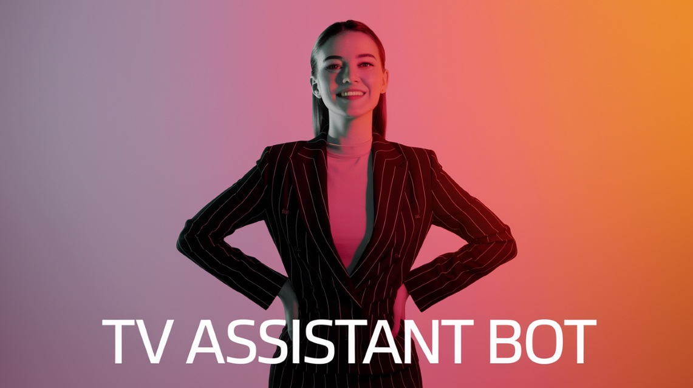

# WhatsApp TV Shopping Assistant Bot 🤖📺

&nbsp;

This is a conversational AI chatbot designed to help customers choose the ideal TV based on their preferences and budget — directly from WhatsApp.

Built with [Botpress](https://botpress.com), this bot assists users in comparing smart TV options, answers questions in natural language, and qualifies leads by offering to schedule a call with a human advisor.

---

## ✨ Features

- 📱 **WhatsApp Integration**  
  Users can interact directly from their phones — no app download needed.

- 🧠 **AI-powered Conversations**  
  Understands preferences, suggests products, and clarifies tech terms.

- 🌍 **Multilingual by default**  
  Automatically understands and replies in the user's language — no need to configure anything.

- 🎯 **Lead Qualification**  
  Offers a human handover only when the user is ready to buy.

- 📊 **Sales Team Support**  
  Passes full conversation history to human advisors to close deals faster.

---

## 🔗 Demo

👉 [Click here to try it on WhatsApp](https://wa.me/51933976199)

---

## 🛠 Tech Stack

- **Bot Framework:** Botpress
- **Channel:** WhatsApp Business
- **NLP/Logic:** Custom flows and intents (non-coded)

---

## 📌 Use Case

Imagine walking into an electronics store and being overwhelmed by tech jargon.  
This bot recreates that shopping experience with clarity and guidance — all via chat.

Perfect for:
- Electronics stores 🛍️
- Customer support teams 💬
- AI solution demos for retail businesses 📈

---

## 🙋‍♀️ About the Creator

Developed by [Mabel Suárez](https://www.linkedin.com/in/mabel-suarez-gros), an AI consultant passionate about human-centered automation.  
If you're interested in implementing a solution like this for your business, feel free to [contact me on LinkedIn](https://www.linkedin.com/in/mabel-suarez-gros).

---

## 🧪 Future Improvements

- Product image rendering
- FAQ auto-training from product catalog

---

*Built with ❤️ using AI to empower better conversations.*

> ⚠️ **Private Demo**  
This chatbot is a demonstration created by [Mabel Suárez](https://www.linkedin.com/in/mabel-suarez-gros/).  
It is linked to a WhatsApp number controlled by the author and **is not authorized for commercial use or partial/full reproduction.**

© 2025 Mabel Suárez – All rights reserved.
